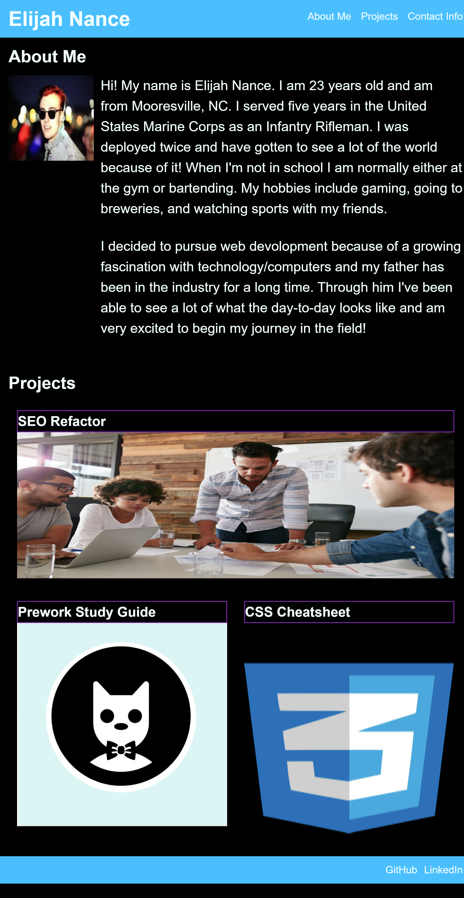

# portfolio-base

[Link to my project: https://elijahnance.github.io/portfolio-base/](https://elijahnance.github.io/portfolio-base/)

## Table of Contents
- [Description](#description)
- [Visuals](#visuals)

## Description
This is a portfolio that contains the first three applications that I've worked on since being in the course and a bio of myself. I used what I've learned in HTML so far to create the framework of the page. I used semantic elements to create headers, sections, and a footer. I used a tags to link my previous projects, contact information, and make it easier to navigate the page. I also added ID's and classes for styling purposes. 

I used CSS to add color to the page, resize sections and headers, and add media querries for multiple screen sizes. I added borders around my headers and hover elements to my links. 

## Visuals
